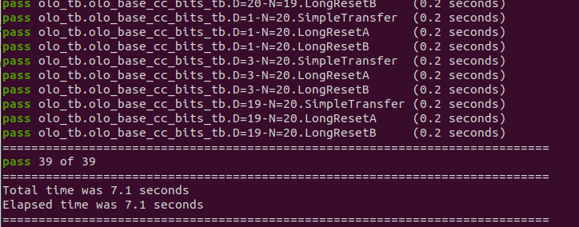
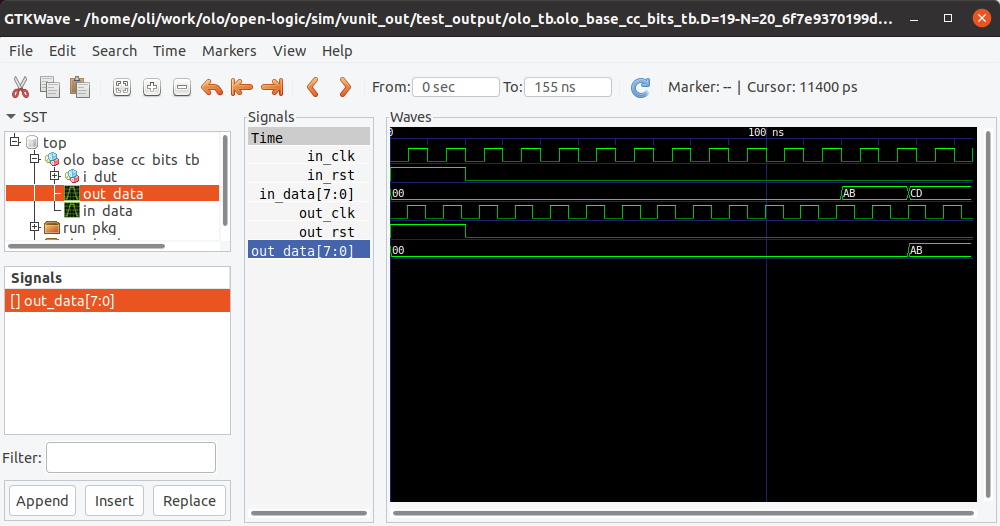

[Back to **Readme**](../Readme.md)

# Open Logic - How To ...

## ... Use Open Logic in a AMD Vivado Project

There is a script to import all *Open Logic* sources into a Vivado project and apply all automatic constraints. To run the script, follow the steps below:

1. Open Vivado and create a project (if not existing yet)
2. Open the TCL shell in Vivado
3. Execute the command `source <open-logic-root>/tools/vivado/import_sources.tcl`
   Replace `<open-logic-root>` by the path of your *Open Logic* working copy.

That's it. Nothing more.

* All *Open Logic* sources are configured to be compiled into the library *olo*
  
* A new constraints file for importing all scoped constraints is added to the Vivado project by the script.
  

## ... Run Simulations

If you want to run simulations on your PC, you need the following prerequisites:

1. *Python 3* must be installed
2. VUnit must be installed: `pip3 install vunit_hdl`
3. Simulator must be installed and added to the *PATH* environment variable  
   1. Default choice: [GHDL](https://github.com/ghdl/ghdl/releases)
   2. Alternative (used for code-coverage analysis): Questasim. 

To run the simulations, navigate to *\<root\>/sim* and execute the following command:

```
python3 run.py            # For GHDL
python3 run.py --modelsim # For Modelsim/QuestaSim
```

Tipp: For faster runtimes, you may want to use multiple threads to execute simulations. This can be achieved by adding the argument `-p 16` (16 is the number of threads, you may use any other number fitting your CPU).

You should now see an output indicating that all tests pass.



## ... Open a Simulation in the GUI

For debugging purposes, you may want to visualize a test-case in the GUI. 

For GHDL simulations, the GTKWave tool must be installed (it's the GUI to GHDL). For Questasim a GUI is included.

To show simulation results in the GUI, navigate to *\<root\>/sim* and execute the following command:

```
python3 run.py <testcase> --gui
```

Where test-case is the exact test-case to display, e.g. "olo_tb.olo_base_cc_bits_tb.D=19-N=20.SimpleTransfer" in above printscreen.

```
python3 run.py olo_tb.olo_base_cc_bits_tb.D=19-N=20.SimpleTransfer --gui
```

The simulator GUI will show up (the example is showing GTKWave - the GHDL GUI):



## ... Analyze Coverage

To analyze code-coverage, the Questasim simulator must be used and coverage must be enabled. After simulations with coverage enabled are ran, the coverage can be reported nicely formated in the console by running the corresponding python script.

Below commands must be ran from the *\<root\>/sim* directory:

```
python3 run.py --modelsim --coverage
python3 ./AnalyzeCoverage.py 
```

You should now see a clean summary of the statement coverage:


## ... Update Badges

The issue badges are updated every night using a GitHub workflow.

For the code coverage badges, the situation is a bit more complicated because Questasim is required to produce coverage and Questasim is non-free and licensed to specific PCs.

In order to update coverage badges, a PC with the following prerequisites is required:

1. Questasim must be installed (including license setup)
2. A credential JSON file giving access to the google cloud storage folder below is required and the path to it must be stored in the environment variable *GCS_FILE*: <br>https://storage.googleapis.com/open-logic-badges
   The google cloud storage is maintained by [obruendl](oliver.bruendler@gmx.ch).

To update the coverage badges, simply execute the following commands in the *\<root\>/sim* directory: 

```
python3 run.py --modelsim --coverage
python3 ./AnalyzeCoverage.py --badges
```


