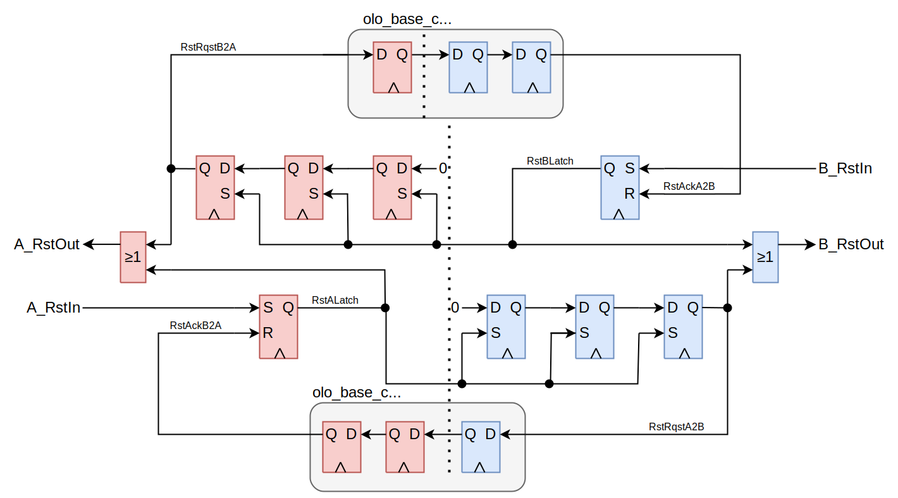

# olo_base_cc_reset

[Back to **Entity List**](../EntityList.md)

## Status Information

 

VHDL Source: [olo_base_cc_reset](../../src/base/vhdl/olo_base_cc_reset.vhd)

## Description

This component synchronizes reset inputs from two clock domains in both directions. Whenever a reset is received from on one clock domain, it produces reset outputs on both clock domains and ensures that both reset outputs are asserted at the same time for at least one clock cycle before they are released again.

This type of reset synchronization is required in many clock crossings. Usually sides of the clock crossing must be reset at the same time to avoid unwanted behavior in corner conditions around resets.

When using the block, you should connect any reset request signals to *A/B_RstINn and reset your logic with the outputs *A/B_RstOut*.

This block follows the general [clock-crossing principles](clock_crossing_principles.md). Read through them for more information.

## Generics

This entity does not have any generics.

## Interfaces

| Name     | In/Out | Length | Description                                        |
| :------- | :----- | :----- | :------------------------------------------------- |
| A_Clk    | in     | 1      | Clock domain A clock                               |
| A_RstIn  | in     | 1      | Reset input (high-active, synchronous to *A_Clk*)  |
| A_RstOut | out    | 1      | Reset output (high-active, synchronous to *A_Clk*) |
| B_Clk    | in     | 1      | Clock domain B clock                               |
| B_RstIn  | in     | 1      | Reset input (high-active, synchronous to *B_Clk*)  |
| B_RstOut | out    | 1      | Reset output (high-active, synchronous to *B_Clk*) |

## Architecture

The exact same functionality is built in both directions.

The concept is explained based on a reset arriving on *A_RstIn* (see waveform below)

* When the reset is asserted, *RstALatch* is set.
* Setting *RstALatch* leads to *A_RstOut* being asserted (i.e. the logic on *A_Clk* is held in reset)
* *RstALatch* causes *RstRqstA2B* to be asserted (asynchronous set). The FF-chain acts as reset synchronizer (asynchronous assert, synchronous de-assert).
* Setting *RstRqstA2B* leads to *B_RstOut* being asserted (i.e. the logic on *B_Clk* is held in reset).
* The detection of the reset on clock-domain A is confirmed by synchronizing *RstRqstA2B* back to the *A_Clk* domain (*RstAckB2A*).
* One *RstAckB2A* is set, *RstALatch* is de-asserted.
* The de-assertion of *RstALatch* causes *A_RstOut* to be de-asserted and a few clock cycles later *B_RstOut* being de-asserted.

As a result it is guaranteed that during at least one clock cycle both resets are asserted at the same time. 

The VHDL code contains all synthesis attributes required to ensure correct behavior of tools (e.g. avoid mapping of the synchronizer FFs into shift registers) for the most common FPGA vendors *AMD* and *Intel*.

Regarding timing constraints, refer to [clock-crossing principles](clock_crossing_principles.md).

